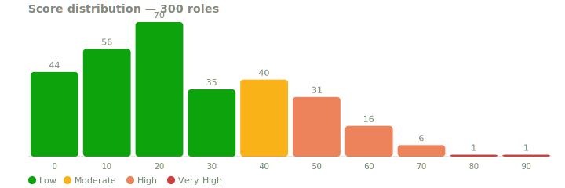
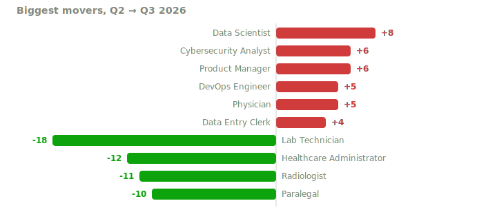
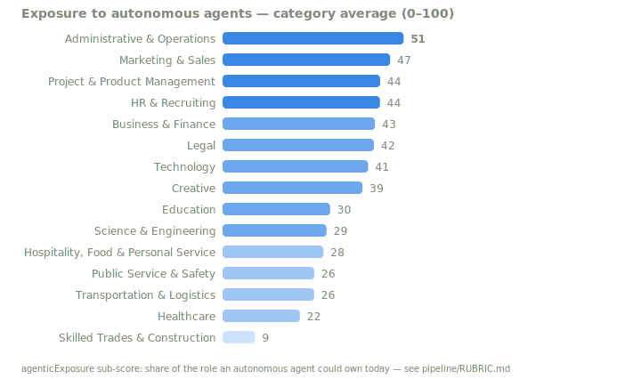

# AI Career Threat Index

> How exposed is your job to AI? 300 professions scored on an open rubric —
> four published sub-scores per role, including exposure to **autonomous agents**.
> Updated quarterly. MIT licensed.

[](LICENSE)


[](https://github.com/Jott2121/ai-career-threat-index/actions/workflows/validate.yml)
[](https://huggingface.co/datasets/Jott2121/ai-career-threat-index)
[](https://doi.org/10.5281/zenodo.21227026)

**[▶ Explore all 300 roles interactively](https://jott2121.github.io/ai-career-threat-index/)** ·
[Winners & Losers this quarter](reports/2026-q3-winners-losers.md) ·
[Methodology](pipeline/RUBRIC.md) ·
[Ask it through your AI assistant (MCP)](mcp/)



## What this is

The AI Career Threat Index scores **300 US professions** on AI displacement risk,
0–100. Unlike a single black-box number, every score decomposes into **four
published sub-scores** with written rationales:

| Sub-score | Question it answers |
|---|---|
| `taskAutomation` | What share of the role's core work could AI do end-to-end today, at ≥90% reliability? |
| `toolMaturity` | How mature and deployed are the AI tools targeting those tasks? |
| `adoption` | What share of employers actually use AI for those tasks in production? |
| `agenticExposure` | What share of the role could **autonomous multi-step agents** own — not copilots, agents? |

combined by an open formula (task automation sets the ceiling; maturity and
adoption determine how much is realized; agentic exposure adds forward pressure):

```
score = taskAutomation × (0.45 + 0.30·toolMaturity/100 + 0.25·adoption/100) + 0.10·agenticExposure
```

The `agenticExposure` factor is, to our knowledge, the first published per-occupation
scoring of exposure to autonomous agents specifically — the thing that changed
between 2024's copilots and 2026's agent deployments.

**Honesty note:** scores are *structured editorial estimates* made against a
[published rubric](pipeline/RUBRIC.md) with named anchors and calibration examples —
informed by O*NET task lists, BLS OES data, and public adoption research. They are
not measurements, and we don't claim otherwise. Every input is in this repo; if you
disagree with a sub-score, [open an issue](../../issues) and argue with the rationale —
that's the point of publishing them.





## Get the data

```bash
git clone https://github.com/Jott2121/ai-career-threat-index.git
# or grab the files directly:
curl -LO https://raw.githubusercontent.com/Jott2121/ai-career-threat-index/main/data/ai-career-threat-index.json
curl -LO https://raw.githubusercontent.com/Jott2121/ai-career-threat-index/main/data/ai-career-threat-index.csv
curl -LO https://raw.githubusercontent.com/Jott2121/ai-career-threat-index/main/data/soc-crosswalk.csv
```

| File | What's in it |
|---|---|
| [`data/ai-career-threat-index.json`](data/ai-career-threat-index.json) | Full dataset: 300 roles, sub-scores, rationales, tasks, defense skills, quarterly history |
| [`data/ai-career-threat-index.csv`](data/ai-career-threat-index.csv) | Flat table, one row per role — Excel/pandas/R ready |
| [`data/soc-crosswalk.csv`](data/soc-crosswalk.csv) | **Every** BLS SOC 2018 occupation (867 codes) mapped to its nearest scored role |
| [`data/changelog.md`](data/changelog.md) | Version history and notable movements |

The crosswalk means any US occupation — even ones we don't score directly — resolves
to a scored neighbor with a stated match quality.

## Use it in code

**Python**
```python
import requests
data = requests.get("https://raw.githubusercontent.com/Jott2121/ai-career-threat-index/main/data/ai-career-threat-index.json").json()

# Roles most exposed to autonomous agents specifically
hot = sorted(data["roles"], key=lambda r: -r["subscores"]["agenticExposure"])[:10]
for r in hot:
    print(f'{r["title"]:35} agentic={r["subscores"]["agenticExposure"]} overall={r["score"]}')
```

**JavaScript**
```javascript
const url = "https://raw.githubusercontent.com/Jott2121/ai-career-threat-index/main/data/ai-career-threat-index.json";
const data = await fetch(url).then(r => r.json());
const rising = data.roles.filter(r => r.score - (r.historicalScores["Q2 2026"] ?? r.score) >= 3);
```

**R**
```r
roles <- read.csv("https://raw.githubusercontent.com/Jott2121/ai-career-threat-index/main/data/ai-career-threat-index.csv")
cor(roles$score, (roles$salary_low_usd + roles$salary_high_usd) / 2)
```

More in [`examples/`](examples/).

## Ask it through your AI assistant

The repo ships a zero-dependency [MCP server](mcp/) so Claude (or any MCP client)
can query the dataset directly:

```bash
git clone https://github.com/Jott2121/ai-career-threat-index.git
claude mcp add threat-index -- node ./ai-career-threat-index/mcp/server.js
```

Then ask: *"Compare paralegal, bookkeeper, and welder — which is most exposed to
autonomous agents, and what should each build to defend?"*

## Schema (v2026.3)

Each role record:

| Field | Type | Description |
|---|---|---|
| `slug` / `title` / `category` | string | Identity; 15 categories |
| `socCode` | string | BLS SOC 2018 detailed occupation code |
| `tier` | 1 \| 2 | 1 = head role (full editorial depth + industry modifiers) |
| `score` | int 0–100 | Composite displacement risk (higher = more exposed) |
| `riskLevel` | enum | `Low` 0–35 · `Moderate` 36–50 · `High` 51–75 · `Very High` 76–100 |
| `subscores` | object | The four published factors, each 0–100 |
| `rationales` | object | One-sentence published justification per factor |
| `agenticRisk` | enum | Band on `agenticExposure` alone |
| `tasksAtRisk` / `tasksGrowing` | string[] | Concrete task lists |
| `salary`, `salaryRange`, `salarySource`, `salaryTrend` | — | BLS-OES-anchored range with named anchor |
| `defenseSkills` | object[] | Three highest-leverage skills to build now |
| `insight` | string | Headline finding |
| `historicalScores` | object | Quarterly history — new roles start at their first published quarter, never backfilled |
| `industryModifiers` | object | Tier-1 only: per-sector adjustments |
| `restatement` | string? | Present when a quarterly move exceeded ±8 — with the reason |

CSV columns are a flat projection; v2026.3 columns were appended after the v2026.2
set, so existing consumers keep working. Scores within 5 points of a band boundary
may retain their prior band across quarterly reviews (stability rule).

## Methodology

Methodology v2 (Q3 2026 onward) is fully specified in [`pipeline/RUBRIC.md`](pipeline/RUBRIC.md):
factor definitions, scoring anchors, calibration examples, the formula, band
hysteresis, salary anchoring, and sources. The dataset regenerates deterministically
from per-role source files:

```bash
python3 pipeline/score.py          # role sources -> JSON + CSV + crosswalk + quarterly report
python3 pipeline/generate_svgs.py  # README charts
pytest tests/                      # 30+ integrity checks (CI runs these on every push)
```

Historical quarters (Q1 2025 – Q2 2026) were published under methodology v1
(50/30/20 weighted composite, no agentic factor) and are retained as published.
Quarterly moves larger than ±8 points require a stated restatement reason — see the
[quarterly report](reports/2026-q3-winners-losers.md).

## Cite it

```
The MeritForge Team (2026). AI Career Threat Index v2026.3.
https://github.com/Jott2121/ai-career-threat-index (DOI: 10.5281/zenodo.21227026)
```

See [`CITATION.cff`](CITATION.cff) for BibTeX and more formats. When citing in
editorial content, a link to this repo or the
[interactive explorer](https://jott2121.github.io/ai-career-threat-index/) is appreciated.

## Contributing

Disagree with a score? The sub-scores and rationales are published precisely so you
can attack them: [open an issue](../../issues) naming the role, the factor, and the
evidence. Better adoption data for an industry is especially welcome. Accepted
corrections land in the next quarterly review with attribution.

## About

Maintained by [Jeff Otterson](https://github.com/Jott2121) / The MeritForge Team.
The interactive tool also lives at [meritforgeai.com](https://www.meritforgeai.com/tools/ai-career-threat-index/).

---

⭐ **If this dataset is useful, star the repo** — stars are how researchers and
journalists find it.
